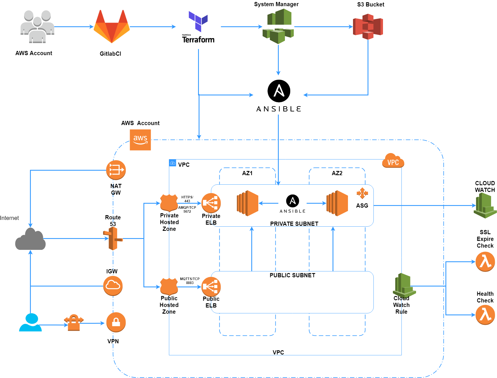

# RABBITMQ

RABBITMQ Cluster Installation Using Terraform and Ansible on AWS Autoscaling Group

This code include create , destroy and update RabbitMQ Cluster

Cluster Deployment on AWS using Terraform

Application Installation on EC2 using Ansible

